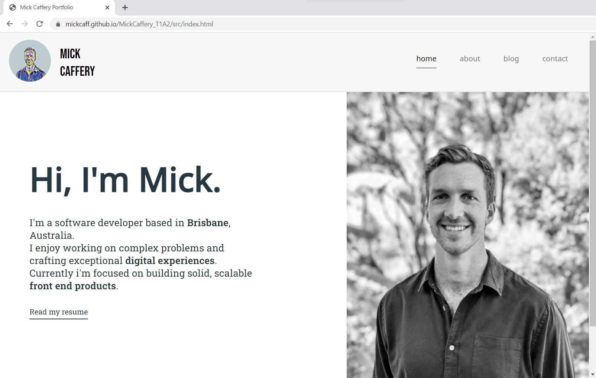
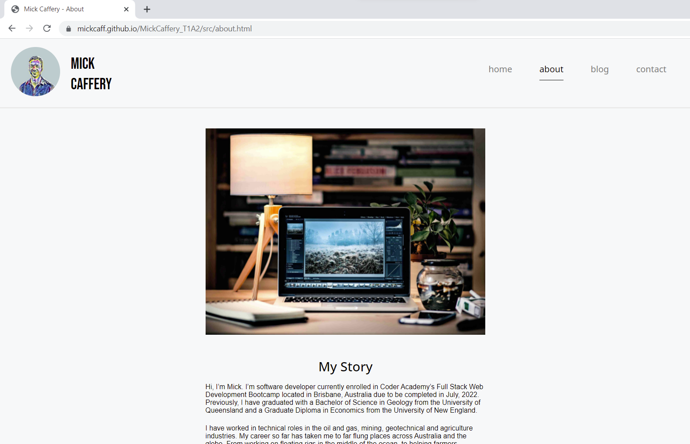
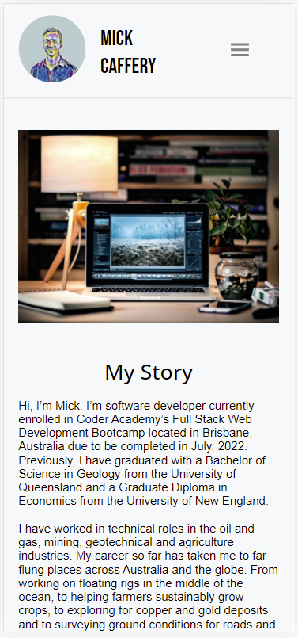
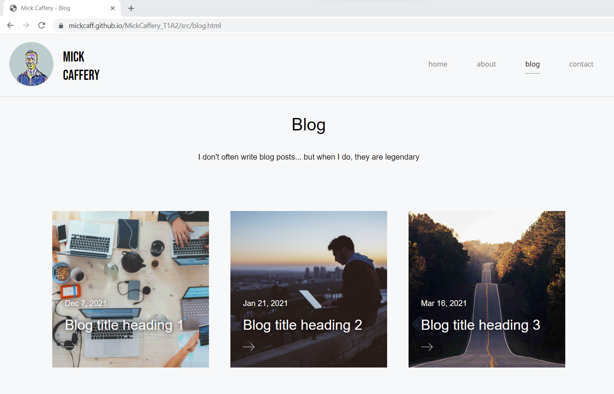
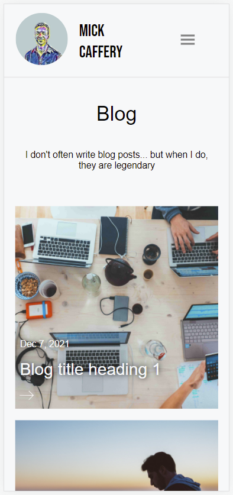
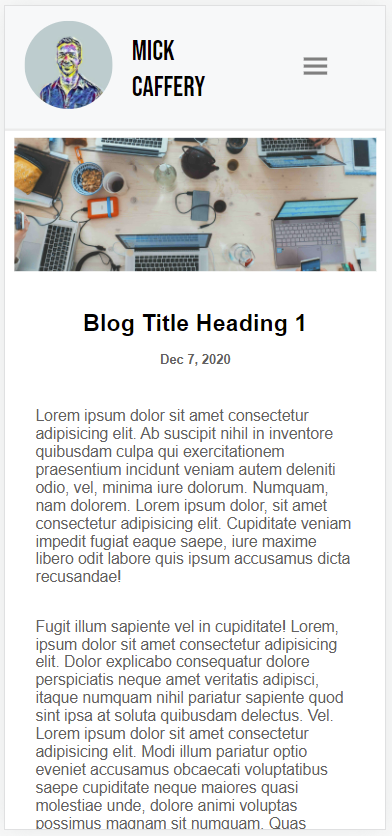
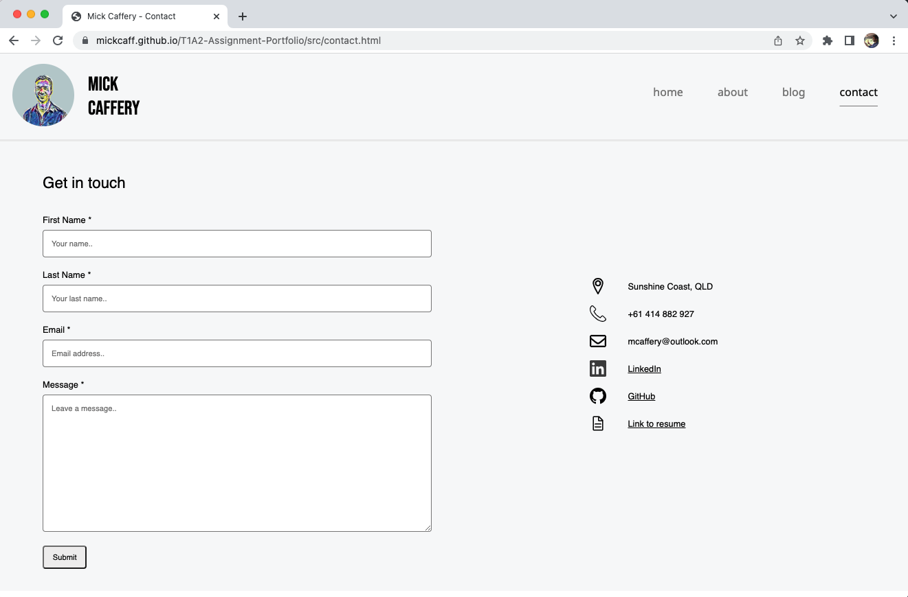
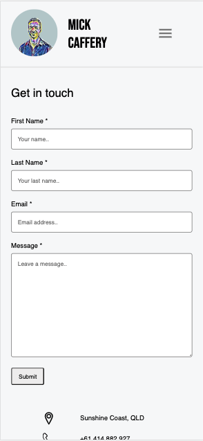

# T1A2 - Portfolio Website

#### Portfolio website link: https://mickcaff.github.io/T1A2-Assignment-Portfolio/src/

#### GitHub repo link: https://github.com/mickcaff/T1A2-Assignment-Portfolio

# Purpose

The purpose of this website is to showcase myself as a software developer to employers and prospective clients. The website provides information about my professional background, skills, interests and coding abilities.

# Functionality / features

The website has adopted a simple and classic aesthetic with a common theme, in order to deliver the information in a straightforward manner with a high degree of clarity. 

### The website contains the following features:

- A simple **navigation header** displays my name, avatar and navigational links. This is used to navigate between all the main pages. 

- The **home page** contains a hero photo of myself and the short introductory paragraph, followed by a link to my PDF resume. The home page footer contains links to my LinkedIn and GitHub accounts. 

- The **about page** details my professional backstory, along with information about my interests, development skills, and tech stack. 

- The **blog page** simply lays out all blog posts in a grid formation. Each blog has a hero photo which is clearly displayed on a square tile, with blog title and date overlayed. 

- **Blog article pages** clearly show the article's hero photo followed by title, date and contents of the article. A narrow colomn on the right side displays information about me, recent posts, and links to socials.

- The **contact page** has a message input form, and also details my address, phone number, email and links to Linkedin, Github, and a link to my PDF resume. 

# Sitemap

The sitemap below details how each page is linked to each other. The main pages can be navigated to from any of the main pages. The blog posts are linked to the blog page. LinkedIn, GitHub and PDF Resume are linked externally to a new tab. 

# Screenshots

## Home

##### Mobile view

## About

##### Mobile view

## Blog

##### Mobile view

## Blog Article

##### Mobile view

## Contact

##### Mobile view

# Target audience

The target audiences are prospective clients and employers. I have made the assumption that viewers have a basic understanding of programming languages and development stacks.

# Tech stack

The site was built and styled by myself with basic **HTML** and **CSS**. There was no use of any framework. The site has been deployed on **GitHub Pages**. 